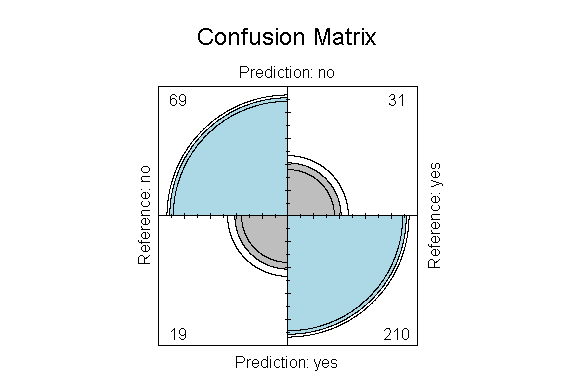
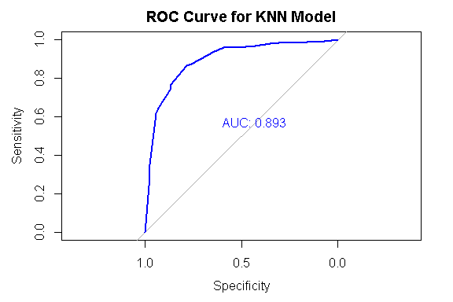

Business Intelligence Project
================
<Specify your name here>
<Specify the date when you submitted the lab>

- [Student Details](#student-details)
- [Setup Chunk](#setup-chunk)
- [Load the dataset](#load-the-dataset)
- [Split the dataset](#split-the-dataset)
- [Accuracy and Cohen’s Kappa](#accuracy-and-cohens-kappa)
  - [Determine the Baseline Accuracy](#determine-the-baseline-accuracy)
  - [Train the Model](#train-the-model)
  - [Display the Model’s Performance](#display-the-models-performance)
    - [Use the metric calculated by caret when training the
      model](#use-the-metric-calculated-by-caret-when-training-the-model)
    - [Compute the metric yourself using the test
      dataset](#compute-the-metric-yourself-using-the-test-dataset)
    - [Display a graphical confusion
      matrix](#display-a-graphical-confusion-matrix)
- [RMSE, R Squared, and MAE](#rmse-r-squared-and-mae)
  - [Train the Model](#train-the-model-1)
  - [Display the Model’s Performance](#display-the-models-performance-1)
    - [Use the metric calculated by caret when training the
      model](#use-the-metric-calculated-by-caret-when-training-the-model-1)
    - [Compute the metric yourself using the test
      dataset](#compute-the-metric-yourself-using-the-test-dataset-1)
      - [RMSE](#rmse)
      - [SSR](#ssr)
      - [SST](#sst)
      - [R Squared](#r-squared)
      - [MAE](#mae)
- [Area Under ROC Curve](#area-under-roc-curve)
  - [Train the Model](#train-the-model-2)
  - [Display the Model’s Performance](#display-the-models-performance-2)
    - [Use the metric calculated by caret when training the
      model](#use-the-metric-calculated-by-caret-when-training-the-model-2)
    - [Compute the metric yourself using the test
      dataset](#compute-the-metric-yourself-using-the-test-dataset-2)
      - [Sensitivity and Specificity](#sensitivity-and-specificity)
      - [AUC](#auc)
- [Logarithmic Loss (LogLoss)](#logarithmic-loss-logloss)
  - [Train the Model](#train-the-model-3)
  - [Display the Model’s Performance](#display-the-models-performance-3)

# Student Details

|                                              |                             |
|----------------------------------------------|-----------------------------|
| **Student ID Number**                        | 119630,135844,131038,104135 |
| **Student Name**                             | beasts                      |
| **BBIT 4.2 Group**                           | A&B&C                       |
| **BI Project Group Name/ID (if applicable)** | beasts                      |

# Setup Chunk

**Note:** the following KnitR options have been set as the global
defaults: <BR>
`knitr::opts_chunk$set(echo = TRUE, warning = FALSE, eval = TRUE, collapse = FALSE, tidy = TRUE)`.

More KnitR options are documented here
<https://bookdown.org/yihui/rmarkdown-cookbook/chunk-options.html> and
here <https://yihui.org/knitr/options/>.

# Load the dataset

``` r
library(AER)
```

    ## Loading required package: car

    ## Loading required package: carData

    ## Loading required package: lmtest

    ## Loading required package: zoo

    ## 
    ## Attaching package: 'zoo'

    ## The following objects are masked from 'package:base':
    ## 
    ##     as.Date, as.Date.numeric

    ## Loading required package: sandwich

    ## Loading required package: survival

``` r
data("Affairs")
#str(Affairs)
```

# Split the dataset

**Description:**45% of the original data will be used to train the model
and 55% of the original data will be used to test the model.

``` r
library(caret)
```

    ## Loading required package: ggplot2

    ## Loading required package: lattice

    ## 
    ## Attaching package: 'caret'

    ## The following object is masked from 'package:survival':
    ## 
    ##     cluster

``` r
train_index <- createDataPartition(Affairs$yearsmarried,
                                   p = 0.45,
                                   list = FALSE)
affairs_train <- Affairs[train_index, ]
affairs_test <- Affairs[-train_index, ]
```

# Accuracy and Cohen’s Kappa

## Determine the Baseline Accuracy

``` r
affairs_freq <- Affairs$yearsmarried
cbind(frequency =
        table(affairs_freq),
      percentage = prop.table(table(affairs_freq)) * 100)
```

    ##       frequency percentage
    ## 0.125        11   1.830283
    ## 0.417        10   1.663894
    ## 0.75         31   5.158070
    ## 1.5          88  14.642263
    ## 4           105  17.470882
    ## 7            82  13.643927
    ## 10           70  11.647255
    ## 15          204  33.943428

## Train the Model

``` r
train_control <- trainControl(method = "cv", number = 5)

set.seed(7)
affairs_model_glm <-
  train(children  ~ ., data = affairs_train, method = "glm",
        metric = "Accuracy", trControl = train_control)
```

## Display the Model’s Performance

### Use the metric calculated by caret when training the model

``` r
print(affairs_model_glm)
```

    ## Generalized Linear Model 
    ## 
    ## 272 samples
    ##   8 predictor
    ##   2 classes: 'no', 'yes' 
    ## 
    ## No pre-processing
    ## Resampling: Cross-Validated (5 fold) 
    ## Summary of sample sizes: 219, 217, 217, 218, 217 
    ## Resampling results:
    ## 
    ##   Accuracy   Kappa    
    ##   0.7837507  0.4801438

### Compute the metric yourself using the test dataset

``` r
predictions <- predict(affairs_model_glm, affairs_test[, 1:9])
confusion_matrix <-
  caret::confusionMatrix(predictions,
                         affairs_test[, 1:9]$children)

print(confusion_matrix)
```

    ## Confusion Matrix and Statistics
    ## 
    ##           Reference
    ## Prediction  no yes
    ##        no   69  31
    ##        yes  19 210
    ##                                          
    ##                Accuracy : 0.848          
    ##                  95% CI : (0.8046, 0.885)
    ##     No Information Rate : 0.7325         
    ##     P-Value [Acc > NIR] : 4.022e-07      
    ##                                          
    ##                   Kappa : 0.6283         
    ##                                          
    ##  Mcnemar's Test P-Value : 0.1198         
    ##                                          
    ##             Sensitivity : 0.7841         
    ##             Specificity : 0.8714         
    ##          Pos Pred Value : 0.6900         
    ##          Neg Pred Value : 0.9170         
    ##              Prevalence : 0.2675         
    ##          Detection Rate : 0.2097         
    ##    Detection Prevalence : 0.3040         
    ##       Balanced Accuracy : 0.8277         
    ##                                          
    ##        'Positive' Class : no             
    ## 

### Display a graphical confusion matrix

``` r
fourfoldplot(as.table(confusion_matrix), color = c("grey", "lightblue"),
             main = "Confusion Matrix")
```

<!-- -->

# RMSE, R Squared, and MAE

## Train the Model

``` r
train_control <- trainControl(method = "boot", number = 1000)

affairs_model_lm <-
  train(yearsmarried ~ ., data = affairs_train,
        na.action = na.omit, method = "lm", metric = "RMSE",
        trControl = train_control)
```

## Display the Model’s Performance

### Use the metric calculated by caret when training the model

``` r
print(affairs_model_lm)
```

    ## Linear Regression 
    ## 
    ## 272 samples
    ##   8 predictor
    ## 
    ## No pre-processing
    ## Resampling: Bootstrapped (1000 reps) 
    ## Summary of sample sizes: 272, 272, 272, 272, 272, 272, ... 
    ## Resampling results:
    ## 
    ##   RMSE      Rsquared   MAE     
    ##   3.158981  0.6810477  2.528421
    ## 
    ## Tuning parameter 'intercept' was held constant at a value of TRUE

### Compute the metric yourself using the test dataset

``` r
predictions <- predict(affairs_model_lm, affairs_test[, 1:9])
print(predictions)
```

    ##           4           5          11          29          44          45 
    ##  6.53056043  4.18969377  9.16062413  5.64526030  2.55265937 17.60052652 
    ##          49          50          86         108         115         116 
    ##  0.71584228 10.13027844  4.30382434 11.53162759  1.64566995  7.17846178 
    ##         123         127         129         137         139         162 
    ##  1.64566995  1.64566995  7.53812016  9.65365614  1.71581281 12.38195339 
    ##         163         165         192         194         210         217 
    ##  1.87100063  2.87043133  3.31813377  2.32752290  8.05201228 16.50166012 
    ##         224         228         239         245         262         265 
    ##  7.92960041  0.44652389  7.19875602  6.04652812  2.47978026  7.67139668 
    ##         267         277         292         293         295         324 
    ##  6.06975282 12.54688666 11.69885634  4.40903863  8.12205804  2.38772610 
    ##         351         355         361         362         370         374 
    ## 11.57771657 10.10431749 14.86739174  2.32166199  3.88833152  9.49432156 
    ##         382         383         384         412         416         422 
    ##  7.05439155  5.81826698  5.03515359  1.78265563  2.16930752  5.57672081 
    ##         435         482         486         490         491         508 
    ##  1.63665657 10.07816234 18.66819301 13.80123218 18.55386824  9.80894106 
    ##         512         517         537         538         571         586 
    ##  9.58351328 17.96330957 18.14748589  7.98167521 12.19777706 10.82703349 
    ##         594         597         603         604         612         613 
    ##  5.11309290  2.55285358  7.13447407 13.78037207 12.39086966  8.13473395 
    ##         627         630         631         632         667         671 
    ## 10.03427173  1.68965766  2.65411403  4.14172442  9.36519180 11.50849999 
    ##         673         709         717         726         736         737 
    ##  5.95855271  6.49406481 15.64442222 18.28636111 10.39969393  0.85593379 
    ##         739         745         747         763         774         779 
    ##  8.01076082  4.02008675 12.38195339  6.74809466  6.86222523 15.55220295 
    ##         784         794         795         798         803         807 
    ##  9.78664264 19.64191129  2.32156488 11.99320939 17.73797889  2.14031901 
    ##         820         851         856         859         867         870 
    ## 13.32971072 10.27227833 14.22192295  9.62549681  7.62912313  2.42878335 
    ##         873         875         876         880         903         904 
    ##  5.50789135  7.91465701  7.05439155  8.02971386  6.25392914 10.21844806 
    ##         905         909         910         914         915         916 
    ## 11.73373357 10.40861021  1.68965766  2.13140274  8.18397539  7.50798336 
    ##         920         926         929         931         961         966 
    ##  1.75687006  4.25375371 12.40962850  1.80671868 16.19118739  3.77713141 
    ##         967         987        1009        1021        1030        1038 
    ##  8.85237824  0.59279543 11.45855427 11.68598622  9.61128549  9.71264304 
    ##        1039        1045        1068        1070        1072        1077 
    ## 11.58370239 11.65782689  6.33887700  2.84832712 17.13387168 11.61676964 
    ##        1081        1089        1096        1102        1107        1109 
    ##  7.78552725  4.17830213  2.46175350 13.34764037 10.32964817 15.96464041 
    ##        1115        1119        1124        1126        1133        1140 
    ## 17.58269397  7.83559787  8.02971386 -0.04812517 18.10409186  7.31874750 
    ##        1157        1158        1177        1178        1180        1195 
    ##  5.94214301 15.20876006  7.20168647  9.80894106  2.49892621  4.44411006 
    ##        1207        1209        1215        1221        1235        1242 
    ##  7.83330239 10.79167271  2.04826486 10.10431749  3.42904323  0.67478503 
    ##        1260        1266        1273        1276        1282        1298 
    ##  8.21977890 11.12212058  0.22119321 10.44377874  9.68152545  3.69807227 
    ##        1299        1311        1319        1324        1327        1328 
    ## 10.44368164  7.34986509  0.63079732  0.22715574  8.05494273  7.03505205 
    ##        1330        1333        1344        1359        1361        1364 
    ## 10.40861021  4.77739129  5.55178196  9.16072123 15.27587536  2.39756866 
    ##        1390        1393        1394        1407        1408        1412 
    ##  1.64566995  6.13979858  9.61138259  3.98653661  9.87898682  5.49605830 
    ##        1413        1417        1418        1419        1420        1423 
    ##  9.38019100  4.66536200  9.90675903 15.53730085  7.78431095  5.70706687 
    ##        1424        1432        1433        1438        1450        1469 
    ## 12.06723679  4.07859077 11.66378491  7.24860464  5.81218406 18.13117330 
    ##        1481        1482        1497        1513        1515        1534 
    ##  3.62792941  3.88833152  7.69926599 14.65097734  9.52028252 11.31438400 
    ##        1540        1551        1555        1566        1576        1584 
    ##  7.60135092  2.36564969 16.07886808 17.74689517  9.71659688 11.66378491 
    ##        1590        1595        1603        1608        1615        1616 
    ##  2.55275648 18.89342658  7.42000795  5.16093734  5.48571784  9.45619477 
    ##        1617        1620        1637        1650        1654        1665 
    ## 15.24182731  2.32752290  6.56675169  7.82668160 13.92855069  8.06459109 
    ##        1670        1671        1691        1695        1698        1704 
    ##  2.14031901  9.06971826 13.21558015  7.51206211 12.17455236 19.86724197 
    ##        1705        1723        1758        1773        1775        1793 
    ## 12.38185629  1.30620871  7.55898027  4.68848959 15.71193764 15.60935079 
    ##        1808        1818        1827        1843        1846        1850 
    ##  9.35827970  2.25738004  5.78695519  7.08755591  0.35628550  3.83600753 
    ##        1851        1861        1873        1875        1885        1895 
    ##  7.54398107  5.80326779  0.22412367  7.92449957 10.04108673  9.22783654 
    ##        1896        1897        1904        1916        1920        1940 
    ##  1.90607206  6.26284542  7.99444822 13.41475567  6.27989010  5.82119744 
    ##        1947        1949        1952        1960        9023          12 
    ##  7.69916889  1.68965766  2.02618845  1.75980052  9.88790309  7.97224537 
    ##          43          53          67          79         133         154 
    ## 11.93114831 11.77382774  0.82626744  5.35061519  9.89233903 12.29179253 
    ##         159         174         182         186         204         215 
    ## 14.83205168 16.31794357  2.39737291 10.84564927 11.91945823 15.59551281 
    ##         232         275         287         325         344         353 
    ##  8.46382247  8.54583986  3.31413772  8.14895820  6.55885529  0.73602905 
    ##         354         367         483         513         576         635 
    ##  9.90608119 10.07154925  9.82229327  4.10730698  8.11296049  4.68255360 
    ##         659         666         729         755         758         797 
    ##  3.33206737  8.14905531  9.79653439  1.50334875  4.94295570 11.03683480 
    ##         834         893         933         951         972         975 
    ##  9.63331527 10.84857973  7.95206310 10.06279374  6.30756366 12.45436797 
    ##         981         986        1002        1007        1011        1035 
    ##  4.74389097  9.77990968  8.07190324 16.31498532  8.88131947 10.80459202 
    ##        1050        1056        1057        1080        1125        1131 
    ##  7.53724812 15.45188650  6.22416569  9.16857734  8.90834821  8.15246786 
    ##        1138        1150        1169        1218        1236        1247 
    ##  5.78573332 11.21814630  7.98109447  8.90505122 13.05626697  7.10906937 
    ##        1294        1353        1427        1445        1543        1548 
    ## 19.27246083 15.92179091 11.92210346 12.78227182  9.16777963 11.34326026 
    ##        1550        1561        1564        1573        1664        1674 
    ##  4.74389097 16.10555957 11.51552691  5.41074105 12.05380871  4.96671931 
    ##        1682        1697        1716        1730        1743        1763 
    ## 10.89674328  8.36074092  6.14583863 13.53254723 12.17074986 10.95987694 
    ##        1766        1772        1776        1791        1840        1844 
    ##  1.36316012  8.95071886  8.36083803 10.09774881  9.66628543 14.23481079 
    ##        1856        1876        1935        1954        1959 
    ## 14.86399845  7.55100800 15.60312414  7.57963170  4.76164420

#### RMSE

``` r
rmse <- sqrt(mean((affairs_test$yearsmarried - predictions)^2))
print(paste("RMSE =", rmse))
```

    ## [1] "RMSE = 3.06827357973978"

#### SSR

``` r
ssr <- sum((affairs_test$yearsmarried - predictions)^2)
print(paste("SSR =", ssr))
```

    ## [1] "SSR = 3097.3056080825"

#### SST

``` r
sst <- sum((affairs_test$yearsmarried - mean(affairs_test$yearsmarried))^2)
print(paste("SST =", sst))
```

    ## [1] "SST = 10281.9189975076"

#### R Squared

``` r
r_squared <- 1 - (ssr / sst)
print(paste("R Squared =", r_squared))
```

    ## [1] "R Squared = 0.698761913137683"

#### MAE

``` r
absolute_errors <- abs(predictions - affairs_test$yearsmarried)
mae <- mean(absolute_errors)
print(paste("MAE =", mae))
```

    ## [1] "MAE = 2.42906692779362"

# Area Under ROC Curve

## Train the Model

``` r
train_control <- trainControl(method = "cv", number = 10,
                              classProbs = TRUE,
                              summaryFunction = twoClassSummary)

set.seed(7)
affairs_model_knn <-
  train(children ~ ., data = affairs_train, method = "knn",
        metric = "ROC", trControl = train_control)
```

## Display the Model’s Performance

### Use the metric calculated by caret when training the model

``` r
print(affairs_model_knn)
```

    ## k-Nearest Neighbors 
    ## 
    ## 272 samples
    ##   8 predictor
    ##   2 classes: 'no', 'yes' 
    ## 
    ## No pre-processing
    ## Resampling: Cross-Validated (10 fold) 
    ## Summary of sample sizes: 245, 244, 244, 245, 245, 245, ... 
    ## Resampling results across tuning parameters:
    ## 
    ##   k  ROC        Sens       Spec     
    ##   5  0.7822328  0.6013889  0.9043860
    ##   7  0.8084917  0.5791667  0.9099415
    ##   9  0.8130279  0.5555556  0.9260234
    ## 
    ## ROC was used to select the optimal model using the largest value.
    ## The final value used for the model was k = 9.

### Compute the metric yourself using the test dataset

#### Sensitivity and Specificity

``` r
library(pROC)
```

    ## Type 'citation("pROC")' for a citation.

    ## 
    ## Attaching package: 'pROC'

    ## The following objects are masked from 'package:stats':
    ## 
    ##     cov, smooth, var

``` r
predictions <- predict(affairs_model_knn, affairs_test[, 1:9])
print(predictions)
```

    ##   [1] yes yes yes yes no  yes no  yes yes yes no  yes no  no  yes yes no  yes
    ##  [19] no  no  yes no  yes yes no  no  yes no  no  yes yes yes yes no  yes yes
    ##  [37] yes yes yes no  yes yes yes yes no  no  no  yes no  yes yes yes yes yes
    ##  [55] yes yes yes yes yes yes yes no  yes yes yes yes yes no  no  yes yes yes
    ##  [73] yes yes yes yes yes no  yes no  yes yes yes yes yes yes no  yes yes no 
    ##  [91] yes yes yes yes yes no  yes yes yes yes no  yes yes yes no  no  yes yes
    ## [109] no  no  yes yes yes yes yes no  yes yes yes yes yes yes yes no  yes yes
    ## [127] yes no  no  yes yes yes yes yes yes no  yes yes yes yes yes yes no  yes
    ## [145] yes yes no  yes no  no  yes yes no  yes yes yes yes yes no  no  yes yes
    ## [163] yes no  yes yes yes yes no  yes yes yes yes yes yes yes yes yes yes yes
    ## [181] yes no  yes yes no  yes no  no  yes yes yes yes yes no  yes yes yes yes
    ## [199] yes yes yes yes no  yes yes no  yes yes yes yes no  yes yes yes yes yes
    ## [217] yes no  yes yes yes yes yes no  yes yes yes no  yes no  no  yes yes yes
    ## [235] no  yes yes yes no  yes yes no  yes no  yes yes yes yes no  yes yes yes
    ## [253] yes yes yes yes yes yes yes yes no  yes yes no  yes yes yes no  yes no 
    ## [271] yes yes yes no  no  yes yes yes yes yes yes yes yes yes yes yes yes yes
    ## [289] yes yes yes yes yes yes yes yes yes yes yes yes yes yes yes yes yes yes
    ## [307] no  yes yes yes yes no  yes yes no  yes yes yes no  yes yes yes yes yes
    ## [325] yes yes yes yes no 
    ## Levels: no yes

``` r
confusion_matrix <-
  caret::confusionMatrix(predictions,affairs_test[, 1:9]$children)
print(confusion_matrix)
```

    ## Confusion Matrix and Statistics
    ## 
    ##           Reference
    ## Prediction  no yes
    ##        no   58  17
    ##        yes  30 224
    ##                                           
    ##                Accuracy : 0.8571          
    ##                  95% CI : (0.8146, 0.8931)
    ##     No Information Rate : 0.7325          
    ##     P-Value [Acc > NIR] : 4.119e-08       
    ##                                           
    ##                   Kappa : 0.6175          
    ##                                           
    ##  Mcnemar's Test P-Value : 0.08005         
    ##                                           
    ##             Sensitivity : 0.6591          
    ##             Specificity : 0.9295          
    ##          Pos Pred Value : 0.7733          
    ##          Neg Pred Value : 0.8819          
    ##              Prevalence : 0.2675          
    ##          Detection Rate : 0.1763          
    ##    Detection Prevalence : 0.2280          
    ##       Balanced Accuracy : 0.7943          
    ##                                           
    ##        'Positive' Class : no              
    ## 

#### AUC

``` r
predictions <- predict(affairs_model_knn, affairs_test[, 1:9],
                       type = "prob")
print(predictions)
```

    ##             no        yes
    ## 1   0.22222222 0.77777778
    ## 2   0.22222222 0.77777778
    ## 3   0.00000000 1.00000000
    ## 4   0.33333333 0.66666667
    ## 5   0.55555556 0.44444444
    ## 6   0.00000000 1.00000000
    ## 7   0.72727273 0.27272727
    ## 8   0.11111111 0.88888889
    ## 9   0.22222222 0.77777778
    ## 10  0.10000000 0.90000000
    ## 11  0.88888889 0.11111111
    ## 12  0.11111111 0.88888889
    ## 13  0.88888889 0.11111111
    ## 14  0.88888889 0.11111111
    ## 15  0.20000000 0.80000000
    ## 16  0.44444444 0.55555556
    ## 17  1.00000000 0.00000000
    ## 18  0.00000000 1.00000000
    ## 19  1.00000000 0.00000000
    ## 20  0.80000000 0.20000000
    ## 21  0.44444444 0.55555556
    ## 22  0.55555556 0.44444444
    ## 23  0.11111111 0.88888889
    ## 24  0.10000000 0.90000000
    ## 25  0.55555556 0.44444444
    ## 26  0.88888889 0.11111111
    ## 27  0.44444444 0.55555556
    ## 28  0.55555556 0.44444444
    ## 29  0.66666667 0.33333333
    ## 30  0.22222222 0.77777778
    ## 31  0.20000000 0.80000000
    ## 32  0.00000000 1.00000000
    ## 33  0.00000000 1.00000000
    ## 34  0.88888889 0.11111111
    ## 35  0.11111111 0.88888889
    ## 36  0.22222222 0.77777778
    ## 37  0.00000000 1.00000000
    ## 38  0.33333333 0.66666667
    ## 39  0.22222222 0.77777778
    ## 40  0.88888889 0.11111111
    ## 41  0.33333333 0.66666667
    ## 42  0.00000000 1.00000000
    ## 43  0.00000000 1.00000000
    ## 44  0.27272727 0.72727273
    ## 45  1.00000000 0.00000000
    ## 46  1.00000000 0.00000000
    ## 47  0.88888889 0.11111111
    ## 48  0.44444444 0.55555556
    ## 49  1.00000000 0.00000000
    ## 50  0.33333333 0.66666667
    ## 51  0.11111111 0.88888889
    ## 52  0.00000000 1.00000000
    ## 53  0.11111111 0.88888889
    ## 54  0.11111111 0.88888889
    ## 55  0.22222222 0.77777778
    ## 56  0.11111111 0.88888889
    ## 57  0.11111111 0.88888889
    ## 58  0.00000000 1.00000000
    ## 59  0.00000000 1.00000000
    ## 60  0.00000000 1.00000000
    ## 61  0.11111111 0.88888889
    ## 62  0.66666667 0.33333333
    ## 63  0.33333333 0.66666667
    ## 64  0.00000000 1.00000000
    ## 65  0.00000000 1.00000000
    ## 66  0.11111111 0.88888889
    ## 67  0.11111111 0.88888889
    ## 68  0.77777778 0.22222222
    ## 69  0.66666667 0.33333333
    ## 70  0.40000000 0.60000000
    ## 71  0.00000000 1.00000000
    ## 72  0.00000000 1.00000000
    ## 73  0.33333333 0.66666667
    ## 74  0.11111111 0.88888889
    ## 75  0.00000000 1.00000000
    ## 76  0.00000000 1.00000000
    ## 77  0.33333333 0.66666667
    ## 78  0.77777778 0.22222222
    ## 79  0.20000000 0.80000000
    ## 80  0.77777778 0.22222222
    ## 81  0.00000000 1.00000000
    ## 82  0.22222222 0.77777778
    ## 83  0.33333333 0.66666667
    ## 84  0.11111111 0.88888889
    ## 85  0.00000000 1.00000000
    ## 86  0.11111111 0.88888889
    ## 87  0.77777778 0.22222222
    ## 88  0.00000000 1.00000000
    ## 89  0.11111111 0.88888889
    ## 90  0.81818182 0.18181818
    ## 91  0.00000000 1.00000000
    ## 92  0.00000000 1.00000000
    ## 93  0.00000000 1.00000000
    ## 94  0.20000000 0.80000000
    ## 95  0.09090909 0.90909091
    ## 96  0.77777778 0.22222222
    ## 97  0.50000000 0.50000000
    ## 98  0.00000000 1.00000000
    ## 99  0.00000000 1.00000000
    ## 100 0.11111111 0.88888889
    ## 101 0.77777778 0.22222222
    ## 102 0.11111111 0.88888889
    ## 103 0.00000000 1.00000000
    ## 104 0.00000000 1.00000000
    ## 105 0.80000000 0.20000000
    ## 106 0.91666667 0.08333333
    ## 107 0.11111111 0.88888889
    ## 108 0.20000000 0.80000000
    ## 109 1.00000000 0.00000000
    ## 110 1.00000000 0.00000000
    ## 111 0.00000000 1.00000000
    ## 112 0.44444444 0.55555556
    ## 113 0.22222222 0.77777778
    ## 114 0.22222222 0.77777778
    ## 115 0.44444444 0.55555556
    ## 116 0.92307692 0.07692308
    ## 117 0.33333333 0.66666667
    ## 118 0.00000000 1.00000000
    ## 119 0.00000000 1.00000000
    ## 120 0.00000000 1.00000000
    ## 121 0.44444444 0.55555556
    ## 122 0.00000000 1.00000000
    ## 123 0.30000000 0.70000000
    ## 124 0.66666667 0.33333333
    ## 125 0.11111111 0.88888889
    ## 126 0.00000000 1.00000000
    ## 127 0.22222222 0.77777778
    ## 128 0.55555556 0.44444444
    ## 129 1.00000000 0.00000000
    ## 130 0.00000000 1.00000000
    ## 131 0.11111111 0.88888889
    ## 132 0.11111111 0.88888889
    ## 133 0.11111111 0.88888889
    ## 134 0.11111111 0.88888889
    ## 135 0.11111111 0.88888889
    ## 136 0.88888889 0.11111111
    ## 137 0.00000000 1.00000000
    ## 138 0.30000000 0.70000000
    ## 139 0.33333333 0.66666667
    ## 140 0.11111111 0.88888889
    ## 141 0.30000000 0.70000000
    ## 142 0.11111111 0.88888889
    ## 143 0.66666667 0.33333333
    ## 144 0.40000000 0.60000000
    ## 145 0.20000000 0.80000000
    ## 146 0.11111111 0.88888889
    ## 147 0.77777778 0.22222222
    ## 148 0.11111111 0.88888889
    ## 149 0.66666667 0.33333333
    ## 150 0.77777778 0.22222222
    ## 151 0.11111111 0.88888889
    ## 152 0.11111111 0.88888889
    ## 153 0.90909091 0.09090909
    ## 154 0.11111111 0.88888889
    ## 155 0.00000000 1.00000000
    ## 156 0.33333333 0.66666667
    ## 157 0.11111111 0.88888889
    ## 158 0.11111111 0.88888889
    ## 159 1.00000000 0.00000000
    ## 160 1.00000000 0.00000000
    ## 161 0.10000000 0.90000000
    ## 162 0.20000000 0.80000000
    ## 163 0.00000000 1.00000000
    ## 164 0.66666667 0.33333333
    ## 165 0.33333333 0.66666667
    ## 166 0.11111111 0.88888889
    ## 167 0.11111111 0.88888889
    ## 168 0.44444444 0.55555556
    ## 169 0.88888889 0.11111111
    ## 170 0.44444444 0.55555556
    ## 171 0.00000000 1.00000000
    ## 172 0.44444444 0.55555556
    ## 173 0.11111111 0.88888889
    ## 174 0.00000000 1.00000000
    ## 175 0.00000000 1.00000000
    ## 176 0.33333333 0.66666667
    ## 177 0.00000000 1.00000000
    ## 178 0.22222222 0.77777778
    ## 179 0.11111111 0.88888889
    ## 180 0.22222222 0.77777778
    ## 181 0.00000000 1.00000000
    ## 182 0.77777778 0.22222222
    ## 183 0.00000000 1.00000000
    ## 184 0.11111111 0.88888889
    ## 185 0.88888889 0.11111111
    ## 186 0.11111111 0.88888889
    ## 187 0.88888889 0.11111111
    ## 188 0.58333333 0.41666667
    ## 189 0.22222222 0.77777778
    ## 190 0.11111111 0.88888889
    ## 191 0.00000000 1.00000000
    ## 192 0.33333333 0.66666667
    ## 193 0.11111111 0.88888889
    ## 194 0.66666667 0.33333333
    ## 195 0.11111111 0.88888889
    ## 196 0.11111111 0.88888889
    ## 197 0.00000000 1.00000000
    ## 198 0.33333333 0.66666667
    ## 199 0.44444444 0.55555556
    ## 200 0.11111111 0.88888889
    ## 201 0.10000000 0.90000000
    ## 202 0.44444444 0.55555556
    ## 203 0.77777778 0.22222222
    ## 204 0.00000000 1.00000000
    ## 205 0.22222222 0.77777778
    ## 206 0.55555556 0.44444444
    ## 207 0.33333333 0.66666667
    ## 208 0.11111111 0.88888889
    ## 209 0.22222222 0.77777778
    ## 210 0.08333333 0.91666667
    ## 211 0.77777778 0.22222222
    ## 212 0.00000000 1.00000000
    ## 213 0.00000000 1.00000000
    ## 214 0.22222222 0.77777778
    ## 215 0.00000000 1.00000000
    ## 216 0.11111111 0.88888889
    ## 217 0.00000000 1.00000000
    ## 218 0.88888889 0.11111111
    ## 219 0.10000000 0.90000000
    ## 220 0.44444444 0.55555556
    ## 221 0.00000000 1.00000000
    ## 222 0.00000000 1.00000000
    ## 223 0.33333333 0.66666667
    ## 224 0.50000000 0.50000000
    ## 225 0.33333333 0.66666667
    ## 226 0.33333333 0.66666667
    ## 227 0.33333333 0.66666667
    ## 228 0.66666667 0.33333333
    ## 229 0.22222222 0.77777778
    ## 230 0.50000000 0.50000000
    ## 231 0.80000000 0.20000000
    ## 232 0.11111111 0.88888889
    ## 233 0.00000000 1.00000000
    ## 234 0.00000000 1.00000000
    ## 235 1.00000000 0.00000000
    ## 236 0.27272727 0.72727273
    ## 237 0.10000000 0.90000000
    ## 238 0.00000000 1.00000000
    ## 239 0.55555556 0.44444444
    ## 240 0.33333333 0.66666667
    ## 241 0.07692308 0.92307692
    ## 242 0.80000000 0.20000000
    ## 243 0.50000000 0.50000000
    ## 244 0.90000000 0.10000000
    ## 245 0.00000000 1.00000000
    ## 246 0.22222222 0.77777778
    ## 247 0.11111111 0.88888889
    ## 248 0.00000000 1.00000000
    ## 249 0.88888889 0.11111111
    ## 250 0.50000000 0.50000000
    ## 251 0.11111111 0.88888889
    ## 252 0.00000000 1.00000000
    ## 253 0.00000000 1.00000000
    ## 254 0.11111111 0.88888889
    ## 255 0.33333333 0.66666667
    ## 256 0.11111111 0.88888889
    ## 257 0.00000000 1.00000000
    ## 258 0.11111111 0.88888889
    ## 259 0.44444444 0.55555556
    ## 260 0.33333333 0.66666667
    ## 261 0.90000000 0.10000000
    ## 262 0.11111111 0.88888889
    ## 263 0.44444444 0.55555556
    ## 264 0.70000000 0.30000000
    ## 265 0.00000000 1.00000000
    ## 266 0.22222222 0.77777778
    ## 267 0.11111111 0.88888889
    ## 268 0.55555556 0.44444444
    ## 269 0.33333333 0.66666667
    ## 270 0.77777778 0.22222222
    ## 271 0.22222222 0.77777778
    ## 272 0.11111111 0.88888889
    ## 273 0.20000000 0.80000000
    ## 274 0.77777778 0.22222222
    ## 275 0.80000000 0.20000000
    ## 276 0.44444444 0.55555556
    ## 277 0.22222222 0.77777778
    ## 278 0.10000000 0.90000000
    ## 279 0.44444444 0.55555556
    ## 280 0.11111111 0.88888889
    ## 281 0.40000000 0.60000000
    ## 282 0.22222222 0.77777778
    ## 283 0.33333333 0.66666667
    ## 284 0.10000000 0.90000000
    ## 285 0.44444444 0.55555556
    ## 286 0.22222222 0.77777778
    ## 287 0.00000000 1.00000000
    ## 288 0.33333333 0.66666667
    ## 289 0.33333333 0.66666667
    ## 290 0.22222222 0.77777778
    ## 291 0.40000000 0.60000000
    ## 292 0.33333333 0.66666667
    ## 293 0.10000000 0.90000000
    ## 294 0.00000000 1.00000000
    ## 295 0.44444444 0.55555556
    ## 296 0.11111111 0.88888889
    ## 297 0.22222222 0.77777778
    ## 298 0.11111111 0.88888889
    ## 299 0.00000000 1.00000000
    ## 300 0.11111111 0.88888889
    ## 301 0.11111111 0.88888889
    ## 302 0.11111111 0.88888889
    ## 303 0.10000000 0.90000000
    ## 304 0.11111111 0.88888889
    ## 305 0.11111111 0.88888889
    ## 306 0.00000000 1.00000000
    ## 307 0.55555556 0.44444444
    ## 308 0.22222222 0.77777778
    ## 309 0.11111111 0.88888889
    ## 310 0.44444444 0.55555556
    ## 311 0.22222222 0.77777778
    ## 312 0.55555556 0.44444444
    ## 313 0.00000000 1.00000000
    ## 314 0.33333333 0.66666667
    ## 315 1.00000000 0.00000000
    ## 316 0.00000000 1.00000000
    ## 317 0.00000000 1.00000000
    ## 318 0.18181818 0.81818182
    ## 319 0.66666667 0.33333333
    ## 320 0.22222222 0.77777778
    ## 321 0.10000000 0.90000000
    ## 322 0.00000000 1.00000000
    ## 323 0.33333333 0.66666667
    ## 324 0.22222222 0.77777778
    ## 325 0.00000000 1.00000000
    ## 326 0.22222222 0.77777778
    ## 327 0.11111111 0.88888889
    ## 328 0.00000000 1.00000000
    ## 329 0.55555556 0.44444444

``` r
roc_curve <- roc(affairs_test$children, predictions$no)
```

    ## Setting levels: control = no, case = yes

    ## Setting direction: controls > cases

``` r
plot(roc_curve, main = "ROC Curve for KNN Model", print.auc = TRUE,
     print.auc.x = 0.6, print.auc.y = 0.6, col = "blue", lwd = 2.5)
```

<!-- -->

# Logarithmic Loss (LogLoss)

## Train the Model

``` r
train_control <- trainControl(method = "repeatedcv", number = 5, repeats = 3,
                              classProbs = TRUE,
                              summaryFunction = mnLogLoss)
set.seed(7)

affairs_model_cart <- train(gender ~ ., data = Affairs, method = "rpart",
                         metric = "logLoss", trControl = train_control)
```

## Display the Model’s Performance

``` r
print(affairs_model_cart)
```

    ## CART 
    ## 
    ## 601 samples
    ##   8 predictor
    ##   2 classes: 'female', 'male' 
    ## 
    ## No pre-processing
    ## Resampling: Cross-Validated (5 fold, repeated 3 times) 
    ## Summary of sample sizes: 481, 480, 481, 481, 481, 481, ... 
    ## Resampling results across tuning parameters:
    ## 
    ##   cp          logLoss  
    ##   0.03146853  0.5481035
    ##   0.05594406  0.5826813
    ##   0.28671329  0.6263302
    ## 
    ## logLoss was used to select the optimal model using the smallest value.
    ## The final value used for the model was cp = 0.03146853.
